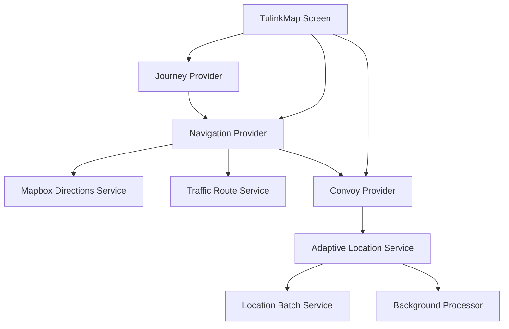
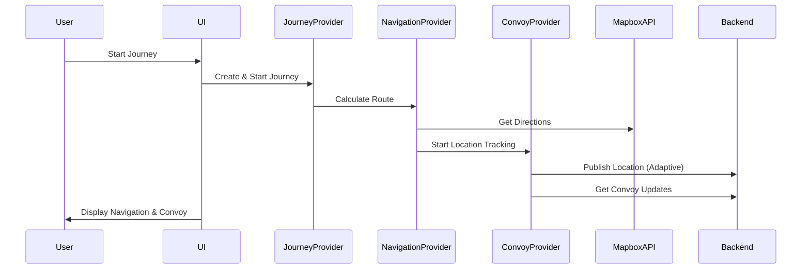

# MapBox Navigation SDK Replacement Implementation Plan

## Overview

This document outlines the comprehensive plan for replacing the current MapBox Maps implementation with the MapBox Navigation SDK (`flutter_mapbox_navigation`) to provide turn-by-turn navigation while maintaining multi-driver convoy visualization. The goal is to seamlessly switch from map view to navigation view when a journey starts, preserving all convoy coordination features.

## Current Foundation

### Current MapBox Implementation Analysis ✅
- **Package**: `mapbox_maps_flutter: ^2.19.1`
- **Core Component**: `TulinkMapScreen` (lib/features/maps/presentation/tulink_map_screen.dart:26)
- **Map Widget**: Standard MapWidget with custom overlay system
- **Convoy Features**:
  - Real-time WebSocket coordination for multiple drivers
  - Custom convoy visualization with driver markers
  - Route polylines using `RoutePolylineOverlay`
  - Convoy status bars and metrics
  - Manual navigation instruction banners

### Key Components to Replace 🔧
1. **Map Rendering**: MapWidget → NavigationViewController
2. **Route Display**: RoutePolylineOverlay → Navigation SDK routes
3. **Navigation UI**: Custom banners → SDK navigation interface
4. **Convoy Overlays**: Custom markers → Overlay system on navigation view
5. **Screen Management**: Single map screen → Conditional map/navigation rendering

---

## Development Phases

### **Phase 1: Navigation SDK Setup and Dependencies**
**Timeline: 2-3 days**  
**Goal: Integrate MapBox Navigation SDK and configure platform-specific settings**

#### **1.1 Package Integration**
**Dependencies to Add:**
```yaml
dependencies:
  flutter_mapbox_navigation: ^0.10.0  # Main navigation SDK
  # Keep existing: mapbox_maps_flutter: ^2.19.1 (for fallback map view)
```

#### **1.2 Platform Configuration**

**Android Setup:**
- Update `android/app/src/main/AndroidManifest.xml`:
  - Add CAMERA, RECORD_AUDIO permissions for navigation
  - Configure background location access
- Update `android/app/build.gradle` for MapBox Navigation SDK
- Add MapBox access tokens with navigation scope

**iOS Setup:**
- Update `ios/Runner/Info.plist`:
  - Add background modes for location and audio
  - Configure camera and microphone permissions
- Update `ios/Podfile` for MapBox Navigation SDK
- Configure MapBox tokens in iOS project

#### **1.3 Core Navigation Service**
**Files to Create:**
```
lib/features/navigation/
├── data/
│   ├── services/
│   │   ├── mapbox_navigation_service.dart      # SDK wrapper
│   │   └── navigation_route_service.dart       # Route management
│   └── models/
│       ├── navigation_route.dart               # Route model
│       └── navigation_instruction.dart         # Turn instructions
├── domain/
│   ├── entities/
│   │   ├── navigation_state.dart               # Navigation state
│   │   └── route_progress.dart                 # Progress tracking
│   └── repositories/
│       └── navigation_repository.dart          # Abstract interface
└── presentation/
    ├── widgets/
    │   ├── turn_by_turn_navigation_widget.dart # Main widget
    │   └── convoy_navigation_overlay.dart      # Multi-driver overlay
    └── providers/
        └── turn_by_turn_provider.dart          # Navigation state management
```

#### **1.2 Journey Entity Enhancement**
**Files to Modify:**
- `lib/features/journeys/domain/entities/journey.dart`
- `lib/features/journeys/data/models/journey_model.dart`

**New Fields:**
```dart
class Journey {
  // ... existing fields ...
  final DirectionsRoute? plannedRoute;
  final List<NavigationStep>? navigationSteps;
  final Duration? estimatedDuration;
  final double? estimatedDistance;
  final DateTime? routeCalculatedAt;
}
```

#### **1.3 Route Visualization Components**
**Files to Create:**
- `lib/features/navigation/presentation/widgets/route_polyline_overlay.dart`
- `lib/features/navigation/presentation/widgets/navigation_instruction_banner.dart`
- `lib/features/navigation/presentation/widgets/route_alternatives_sheet.dart`

**Features:**
- Primary route polyline rendering on map
- Alternative routes with different colors
- Interactive route selection
- Route statistics display (distance, time, traffic conditions)

#### **1.4 Journey Provider Enhancement**
**Files to Modify:**
- `lib/features/journeys/presentation/providers/journey_provider.dart`

**New Methods:**
```dart
class JourneyProvider {
  // ... existing methods ...
  Future<void> calculateRouteForJourney(Journey journey);
  Future<void> selectAlternativeRoute(DirectionsRoute route);
  Future<void> recalculateRoute({bool forceUpdate = false});
}
```

**Success Criteria:**
- [ ] Routes displayed on map with proper styling
- [ ] Turn-by-turn instructions available
- [ ] ETA calculations working with traffic data
- [ ] Alternative route selection functional
- [ ] Integration with existing journey creation flow

---

### **Phase 2: Enhanced Location Streaming Optimization**
**Timeline: Week 3**  
**Goal: Optimize REST API usage patterns for improved performance and battery efficiency**

#### **2.1 Adaptive Location Publishing**
**Files to Create:**
- `lib/features/convoy/data/services/adaptive_location_service.dart`
- `lib/features/convoy/domain/entities/publishing_mode.dart`
- `lib/features/convoy/data/services/location_batch_service.dart`

**Smart Publishing Strategy:**
```dart
enum PublishingMode {
  high,     // 1-2 second intervals (fast movement)
  normal,   // 3-5 second intervals (moderate movement)  
  low,      // 10-15 second intervals (stationary)
  heartbeat // 30 second intervals (extended stationary)
}

class AdaptiveLocationService {
  Future<void> optimizePublishingRate(Position position);
  Future<void> enableBatchPublishing();
  Future<void> handleMovementStateChange(MovementState state);
}
```

#### **2.2 Intelligent Caching Layer**
**Files to Create:**
- `lib/features/convoy/data/services/convoy_cache_service.dart`
- `lib/features/convoy/data/models/cached_convoy_snapshot.dart`

**Cache Strategy:**
- Cache convoy snapshots for 2-5 seconds to reduce API calls
- Implement cache invalidation based on movement patterns
- Background refresh for stale data
- Memory-efficient storage with automatic cleanup

#### **2.3 Background Processing Optimization**
**Files to Create:**
- `lib/features/convoy/data/services/background_location_processor.dart`
- `lib/features/convoy/data/workers/location_publishing_isolate.dart`

**Background Features:**
- Location processing on separate isolate
- Queue management for pending location updates
- Retry mechanism for failed API calls
- Battery-aware publishing rates

#### **2.4 Enhanced Convoy Provider Updates**
**Files to Modify:**
- `lib/features/convoy/presentation/providers/convoy_provider.dart`

**Leveraging Existing Journey Tracking:**
```dart
class ConvoyProvider {
  // Build upon existing _journeyStartTime and _distanceTraveled
  
  Future<void> optimizeLocationPublishingRate();
  Future<void> enableSmartCaching();
  Future<void> handleRouteProgress(NavigationProgress progress);
}
```

**Success Criteria:**
- [ ] 30-50% reduction in REST API calls during stationary periods
- [ ] Improved battery life through adaptive publishing
- [ ] Reduced bandwidth usage with smart caching
- [ ] Maintained real-time accuracy for convoy coordination
- [ ] Background processing doesn't impact UI performance

---

### **Phase 3: Navigation Experience Enhancement**
**Timeline: Week 4**  
**Goal: Implement comprehensive turn-by-turn navigation with real-time guidance**

#### **3.1 Navigation Provider**
**Files to Create:**
- `lib/features/navigation/presentation/providers/navigation_provider.dart`
- `lib/features/navigation/domain/entities/navigation_state.dart`
- `lib/features/navigation/domain/usecases/track_navigation_progress.dart`

**Core Navigation Logic:**
```dart
class NavigationProvider extends ChangeNotifier {
  DirectionsRoute? currentRoute;
  NavigationStep? currentStep;
  NavigationStep? nextStep;
  double? distanceToNextStep;
  Duration? estimatedTimeToDestination;
  NavigationStatus status;
  
  Future<void> startNavigation(Journey journey);
  void updateNavigationProgress(Position currentLocation);
  Stream<NavigationUpdate> getNavigationUpdates();
  Future<void> handleRouteDeviation();
}

enum NavigationStatus {
  idle, navigating, rerouting, arrived, offRoute
}
```

#### **3.2 Enhanced Map Screen Integration**
**Files to Modify:**
- `lib/features/maps/presentation/tulink_map_screen.dart`
- `lib/features/convoy/presentation/widgets/journey_progress_screen.dart`

**UI Enhancements:**
- Turn-by-turn instruction overlay
- Navigation progress bar
- Distance and time to destination
- Next maneuver preview with icons
- Route deviation alerts

#### **3.3 Navigation UI Components**
**Files to Create:**
- `lib/features/navigation/presentation/widgets/navigation_instruction_card.dart`
- `lib/features/navigation/presentation/widgets/route_progress_indicator.dart`
- `lib/features/navigation/presentation/widgets/maneuver_icon.dart`
- `lib/features/navigation/presentation/widgets/navigation_controls.dart`

#### **3.4 Audio Navigation (Optional)**
**Files to Create:**
- `lib/features/navigation/data/services/voice_guidance_service.dart`
- `lib/features/navigation/presentation/providers/audio_navigation_provider.dart`

**Success Criteria:**
- [ ] Turn-by-turn instructions display correctly
- [ ] Route progress updates in real-time
- [ ] Navigation UI integrates with existing journey progress card
- [ ] Route deviation detection and alerts
- [ ] Smooth integration with convoy coordination
- [ ] Audio guidance functional (if implemented)

---

### **Phase 4: Traffic Integration & Route Optimization**
**Timeline: Week 5**  
**Goal: Dynamic route optimization with real-time traffic integration**

#### **4.1 Traffic-Aware Route Service**
**Files to Create:**
- `lib/features/navigation/data/services/traffic_route_service.dart`
- `lib/features/navigation/domain/entities/traffic_condition.dart`
- `lib/features/navigation/data/services/route_monitoring_service.dart`

**Traffic Integration:**
```dart
class TrafficRouteService {
  Future<DirectionsRoute> getTrafficOptimizedRoute(Journey journey);
  Stream<RouteCondition> monitorRouteTraffic(DirectionsRoute route);
  Future<Duration> getRealtimeETA(DirectionsRoute route, Position currentLocation);
  Future<List<TrafficIncident>> getRouteIncidents(DirectionsRoute route);
}
```

#### **4.2 Dynamic Rerouting System**
**Files to Create:**
- `lib/features/navigation/data/services/dynamic_rerouting_service.dart`
- `lib/features/navigation/domain/usecases/evaluate_rerouting_need.dart`
- `lib/features/navigation/presentation/widgets/rerouting_dialog.dart`

**Rerouting Logic:**
- Automatic rerouting when traffic conditions change significantly
- User confirmation for major route changes
- Convoy coordination during rerouting
- Optimal timing for rerouting suggestions

#### **4.3 Route Analytics & Learning**
**Files to Create:**
- `lib/features/navigation/data/services/route_analytics_service.dart`
- `lib/features/navigation/domain/entities/route_performance.dart`

**Analytics Features:**
- Route performance tracking
- Historical traffic pattern learning
- User preference learning (route selection patterns)
- Convoy efficiency metrics

#### **4.4 Advanced Convoy Coordination**
**Files to Modify:**
- `lib/features/convoy/presentation/providers/convoy_provider.dart`
- `lib/features/convoy/data/services/convoy_route_coordination.dart`

**Convoy-Specific Features:**
- Synchronized rerouting for convoy groups
- Leader-follower route coordination
- Convoy-specific ETA calculations
- Group arrival time optimization

**Success Criteria:**
- [ ] Real-time traffic integration working
- [ ] Dynamic rerouting based on traffic conditions
- [ ] Convoy-wide route coordination functional
- [ ] Route analytics providing useful insights
- [ ] Performance optimizations in place
- [ ] Battery and bandwidth usage optimized

---

## Technical Architecture

### **Service Dependencies**


### **Data Flow Architecture**


### **API Integration Points**

#### **Mapbox APIs**
- **Directions API**: `/directions/v5/mapbox/driving-traffic/{coordinates}`
- **Geocoding API**: Address search and reverse geocoding
- **Navigation API**: Real-time traffic and incidents

#### **Backend APIs (Existing)**
- **Location Publishing**: `POST /locations`
- **Convoy Data**: `GET /locations/journeys/{journeyId}/latest`
- **Journey Management**: `/journeys/*` endpoints

### **Performance Considerations**

#### **Memory Management**
- Route caching with TTL
- Convoy snapshot caching
- Background processing for heavy computations
- Efficient GPS data buffering

#### **Network Optimization**
- Adaptive location publishing rates
- Request batching where possible
- Intelligent caching layers
- Retry mechanisms with exponential backoff

#### **Battery Optimization**
- GPS accuracy tuning based on context
- Background processing optimization
- Efficient location update frequencies
- Smart cache utilization

---

## Testing Strategy

### **Unit Tests**
- Service layer testing for all navigation services
- Provider testing for state management
- Model testing for data transformation
- Use case testing for business logic

### **Integration Tests**
- Mapbox API integration testing
- Backend API integration testing
- Navigation flow testing
- Convoy coordination testing

### **End-to-End Tests**
- Complete journey flow testing
- Multi-user convoy scenarios
- Navigation accuracy testing
- Performance benchmarking

### **Testing Tools**
- Existing: `mockito` for mocking (recently added)
- GPS simulation for location testing
- Network simulation for API testing
- Performance profiling tools

---

## Risk Mitigation

### **Technical Risks**
- **Mapbox API rate limits**: Implement caching and request optimization
- **GPS accuracy issues**: Implement accuracy filtering and validation
- **Network connectivity**: Offline capability and graceful degradation
- **Battery drain**: Adaptive location publishing and background optimization

### **Integration Risks**
- **Breaking existing convoy features**: Comprehensive testing and gradual rollout
- **Performance degradation**: Continuous performance monitoring
- **API compatibility**: Version management and backward compatibility

### **Deployment Strategy**
- Feature flags for gradual rollout
- A/B testing for navigation features
- Rollback mechanisms for critical issues
- Monitoring and alerting for performance metrics

---

## Success Metrics

### **Performance Metrics**
- [ ] API response times < 2 seconds for route calculation
- [ ] Location update efficiency: 30-50% reduction in API calls
- [ ] Battery usage improvement: 20-30% reduction during active navigation
- [ ] UI responsiveness: < 16ms frame times during navigation

### **User Experience Metrics**
- [ ] Navigation accuracy: < 10 meter route deviation tolerance
- [ ] Turn-by-turn instruction timing: 100-200 meter advance notice
- [ ] Route recalculation time: < 3 seconds for traffic-based rerouting
- [ ] Convoy coordination latency: < 2 second position updates

### **Quality Metrics**
- [ ] Test coverage: > 80% for new navigation features
- [ ] Code quality: All new code passes linting and static analysis
- [ ] Documentation: Complete API documentation for all new services
- [ ] Performance: No memory leaks or significant performance degradation

---

## Dependencies

### **External Dependencies**
- **Mapbox SDK**: Already integrated
- **Mapbox Directions API**: New integration required
- **Geolocator**: Already in use
- **Dio**: Already in use for HTTP requests

### **Internal Dependencies**
- **Journey entities**: Will be extended
- **Convoy coordination**: Will be enhanced
- **Map visualization**: Will be extended
- **Location services**: Will be optimized

---

## Rollout Plan

### **Phase 1 Rollout**
- Internal testing with basic route visualization
- Beta testing with limited user group
- Performance monitoring and optimization

### **Phase 2 Rollout**
- Gradual rollout to 25% of users
- A/B testing for location optimization
- Performance metrics collection

### **Phase 3 Rollout**
- Navigation features to 50% of users
- User feedback collection and iteration
- Full convoy integration testing

### **Phase 4 Rollout**
- Full feature rollout to all users
- Performance optimization based on real usage
- Long-term monitoring and maintenance

---

*This implementation plan serves as the comprehensive roadmap for RTDB integration and navigation enhancement. Each phase builds upon the previous one while maintaining system stability and user experience quality.*