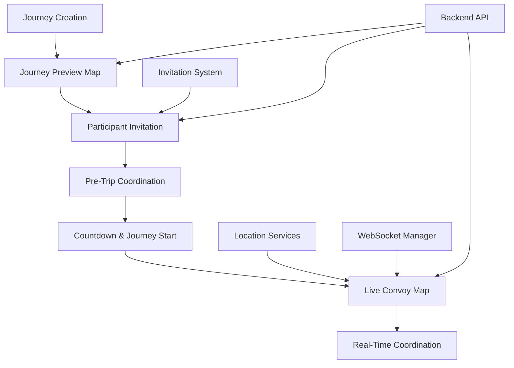
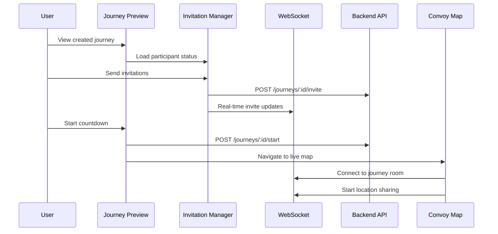

# TuLink Convoy Coordination - Implementation Plan

> **Priority 2: Location Services & Convoy Coordination Implementation**
> 
> This plan outlines the complete implementation of convoy coordination features, from journey creation to real-time tracking, based on the new UX design specifications.

## 📋 Table of Contents

1. [Executive Summary](#executive-summary)
2. [Current State Analysis](#current-state-analysis)
3. [Implementation Architecture](#implementation-architecture)
4. [Phase-by-Phase Implementation](#phase-by-phase-implementation)
5. [Technical Requirements](#technical-requirements)
6. [Risk Assessment](#risk-assessment)
7. [Success Metrics](#success-metrics)
8. [Timeline & Resource Allocation](#timeline--resource-allocation)

---

## 🎯 Executive Summary

### Objective
Implement a complete convoy coordination system that allows users to create journeys, invite participants, and coordinate real-time convoy movement with safety-first design principles.

### Scope
- **New Journey Creation Flow**: Journey details → Map preview → Participant invitation → Countdown start
- **Real-Time Location Services**: GPS tracking, WebSocket communication, convoy formation monitoring
- **Convoy Map Interface**: Live participant tracking, formation visualization, safety indicators
- **Invitation System**: Pending invites, participant management, pre-trip coordination

### Key Deliverables
1. **Journey Preview Map Screen** - Shows journey details and participant status
2. **Participant Invitation System** - Real-time invite management with avatars/status
3. **Convoy Countdown & Start** - 3-2-1 countdown with backend journey initiation
4. **Live Convoy Map** - Real-time participant tracking with convoy formation
5. **Location Services Infrastructure** - GPS tracking, WebSocket coordination, offline handling

---

## 📊 Current State Analysis

### ✅ **Existing Implementation Strengths**

**Authentication System:**
- ✅ Fully functional backend integration
- ✅ Token management with refresh capabilities
- ✅ Secure token storage and automatic refresh

**Journey Creation:**
- ✅ Basic journey creation form (`CreateJourneyPage`)
- ✅ Destination search with Mapbox integration
- ✅ Journey data models and API integration

**Maps Foundation:**
- ✅ Mapbox integration (`TulinkMapScreen`)
- ✅ Basic marker placement and user location
- ✅ Map overlays and styling

**Data Architecture:**
- ✅ Clean architecture with repositories, use cases, providers
- ✅ Proper state management with Provider pattern
- ✅ API integration patterns established

**API Infrastructure (RECENTLY IMPLEMENTED):**
- ✅ **Unified API Routes Pattern**: All endpoints centralized in `ApiRoutes` class
- ✅ **Journey API Service**: `JourneyApiService` following established pattern with standardized error handling
- ✅ **Invitation API Service**: `InvitationApiService` with comprehensive invitation management endpoints
- ✅ **Invitation Repository**: `InvitationRepositoryImpl` updated to use new API service with Result wrapper and streaming capabilities
- ✅ **Journey Remote Data Source**: Refactored to use centralized routes and `ApiHandler` pattern
- ✅ **Invitation Remote Data Source**: Complete implementation following clean architecture pattern
- ✅ **Service Locator Integration**: Updated DI container with proper API service injection

**Backend API Readiness:**
- ✅ Journey management endpoints (`/journeys`, `/journeys/:id/start`, etc.)
- ✅ Invitation system endpoints (`/invitations`, `/journeys/:id/invitations`, etc.)
- ✅ Participant management routes (`/participants`, `/journeys/:id/participants`)
- ✅ User search capabilities (`/users/search`)
- ✅ WebSocket route definitions for real-time updates

### ❌ **Missing Implementation Gaps**

**Journey Flow Integration:**
- ❌ No journey preview screen after creation
- ❌ **Invitation System UI**: Backend integration complete, UI components needed
- ❌ No pre-trip coordination interface
- ❌ No countdown and journey start mechanism

**Location Services:**
- ❌ No GPS tracking implementation
- ❌ No WebSocket integration for real-time updates
- ❌ No convoy formation monitoring
- ❌ No offline location handling

**Convoy Map Features:**
- ❌ No real-time participant markers
- ❌ No convoy formation visualization
- ❌ No convoy status indicators
- ❌ No safety alerts and communication

**Integration & Testing:**
- ⚠️ **API Services**: Implemented but need integration testing
- ⚠️ **Invitation Repository**: Complete but requires UI integration
- ⚠️ **Journey API**: Complete but needs journey lifecycle testing

---

## 🏗️ Implementation Architecture

### System Components Overview



### Core Service Architecture

```typescript
// Core Services Hierarchy
ConvoyCoordinator {
  ├── LocationTrackingService
  │   ├── GPSManager
  │   ├── PermissionHandler
  │   └── OfflineLocationCache
  ├── WebSocketManager
  │   ├── ConnectionHandler
  │   ├── ReconnectionLogic
  │   └── MessageDispatcher
  ├── InvitationManager
  │   ├── InviteDispatcher
  │   ├── ParticipantTracker
  │   └── StatusManager
  └── ConvoyMapController
      ├── ParticipantMarkerManager
      ├── FormationVisualizer
      └── SafetyIndicators
}
```

### Data Flow Architecture



---

## 🚀 Phase-by-Phase Implementation

### **Phase 1: Journey Preview & Navigation (Week 1)**
*Foundation for convoy coordination workflow*

#### 1.1 Journey Preview Map Screen
**File**: `lib/features/journeys/presentation/pages/journey_preview_screen.dart`

```dart
class JourneyPreviewScreen extends StatefulWidget {
  final String journeyId;
  const JourneyPreviewScreen({required this.journeyId});
}
```

**Features:**
- Display journey details (name, destination, creator)
- Show destination marker on map
- Participant list with avatars and status
- Invitation management interface
- Start journey button (when ready)

**UI Components:**
- Map widget with destination marker
- Participant status cards
- Invitation controls
- Journey metadata display

#### 1.2 Navigation Flow Update
**Files to Modify:**
- `lib/features/journeys/presentation/pages/create_journey_page.dart:48-50`
- Update navigation from create journey → journey preview

```dart
if (success && mounted) {
  Navigator.of(context).pushReplacementNamed(
    JourneyPreviewScreen.routeName,
    arguments: journeyProvider.currentJourney!.id,
  );
}
```

**Deliverables:**
- [ ] Journey preview screen with map
- [ ] Navigation flow integration
- [ ] Basic journey metadata display
- [ ] UI foundation for participant management

---

### **Phase 2: Participant Invitation System (Week 1-2)**
*Real-time invitation and participant management*

#### 2.1 Invitation Data Models
**File**: `lib/features/journeys/domain/entities/participant.dart`

```dart
class Participant {
  final String id;
  final String userId;
  final String displayName;
  final String? avatarUrl;
  final ParticipantStatus status; // INVITED, ACCEPTED, DECLINED
  final bool isLeader;
  final DateTime invitedAt;
  final DateTime? joinedAt;
}

enum ParticipantStatus { invited, accepted, declined, active, left }
```

#### 2.2 Invitation Manager Service
**File**: `lib/features/journeys/services/invitation_manager.dart`

```dart
class InvitationManager {
  Future<void> sendInvitation(String journeyId, String userId);
  Future<void> acceptInvitation(String journeyId);
  Future<void> declineInvitation(String journeyId);
  Stream<List<Participant>> getParticipantUpdates(String journeyId);
  Future<List<User>> searchUsers(String query);
}
```

#### 2.3 Real-Time Invitation Updates
**Implementation:**
- WebSocket integration for live invitation status
- Participant list updates without refresh
- Push notifications for invitations

**Backend API Integration:**
- `POST /journeys/:id/invite` - Send invitation
- `POST /journeys/:id/accept` - Accept invitation
- `POST /journeys/:id/decline` - Decline invitation
- `WebSocket: participant-joined` - Real-time updates

**Deliverables:**
- [ ] Participant data models
- [ ] Invitation manager service
- [ ] Real-time invitation updates
- [ ] Invitation UI components

---

### **Phase 3: Pre-Trip Coordination Interface (Week 2)**
*Participant management and journey preparation*

#### 3.1 Participant Management UI
**Components:**
- Participant avatar grid
- Invitation status indicators
- Remove participant functionality (leader only)
- Resend invitation capability

#### 3.2 Journey Readiness Logic
```dart
class JourneyReadinessChecker {
  bool canStartJourney(Journey journey, List<Participant> participants) {
    // Logic for minimum participants, all accepted, etc.
  }
  
  List<String> getReadinessIssues(Journey journey, List<Participant> participants);
}
```

#### 3.3 Pre-Start Countdown Interface
**Features:**
- Countdown timer (3-2-1) with animation
- Participant readiness confirmation
- Last-minute invitation sending
- Journey start API integration

**UI Design:**
```dart
class CountdownWidget extends StatefulWidget {
  final VoidCallback onCountdownComplete;
  final int countdownSeconds; // 3, 2, 1
}
```

**Deliverables:**
- [ ] Participant management interface
- [ ] Journey readiness validation
- [ ] Countdown animation component
- [ ] Pre-start coordination flow

---

### **Phase 4: Location Services Implementation (Week 2-3)**
*Core location tracking and management*

#### 4.1 Location Permissions & Setup
**File**: `lib/features/location/services/location_permission_service.dart`

```dart
class LocationPermissionService {
  Future<bool> requestLocationPermissions();
  Future<bool> hasLocationPermission();
  Future<bool> isLocationServiceEnabled();
  Future<void> openLocationSettings();
}
```

**Platform-Specific Implementation:**
- Android: `ACCESS_FINE_LOCATION`, `ACCESS_COARSE_LOCATION`
- iOS: `NSLocationWhenInUseUsageDescription`, `NSLocationAlwaysAndWhenInUseUsageDescription`

#### 4.2 GPS Location Tracking
**File**: `lib/features/location/services/location_tracking_service.dart`

```dart
class LocationTrackingService {
  Stream<Position> startLocationTracking({
    int updateIntervalMs = 10000,
    double distanceFilter = 10.0,
  });
  
  void stopLocationTracking();
  Future<Position> getCurrentLocation();
  bool get isTracking;
}
```

**Configuration:**
- Update interval: 10 seconds
- Distance filter: 10 meters minimum movement
- High accuracy for convoy coordination
- Battery optimization considerations

#### 4.3 Location Data Repository
**File**: `lib/features/location/data/repositories/location_repository_impl.dart`

```dart
class LocationRepositoryImpl implements LocationRepository {
  Future<void> sendLocationUpdate(LocationUpdate update);
  Future<List<LocationUpdate>> getLatestLocations(String journeyId);
  Stream<LocationUpdate> getLocationUpdates(String journeyId);
  Future<void> cacheLocationOffline(LocationUpdate update);
}
```

**Deliverables:**
- [ ] Location permission management
- [ ] GPS tracking service
- [ ] Location data repository
- [ ] Offline location caching

---

### **Phase 5: WebSocket Integration (Week 3)**
*Real-time communication infrastructure*

#### 5.1 WebSocket Manager
**File**: `lib/core/network/websocket_manager.dart`

```dart
class WebSocketManager {
  Future<void> connect(String journeyId, String authToken);
  void disconnect();
  void sendLocationUpdate(LocationUpdate update);
  Stream<Map<String, dynamic>> get messageStream;
  
  // Connection management
  bool get isConnected;
  Future<void> reconnect();
  void handleConnectionLoss();
}
```

**Features:**
- Automatic reconnection with exponential backoff
- Connection health monitoring
- Message queuing for offline scenarios
- Authentication token management

#### 5.2 Real-Time Message Handling
**Message Types:**
- `location-update`: Participant location changes
- `participant-joined`: New participant joins
- `participant-left`: Participant leaves convoy
- `lag-alert`: Participant falling behind
- `journey-started`: Journey officially begins
- `journey-ended`: Journey completion

#### 5.3 WebSocket Integration with Location
```dart
class ConvoyLocationProvider extends ChangeNotifier {
  final LocationTrackingService _locationService;
  final WebSocketManager _webSocketManager;
  
  Map<String, LocationUpdate> _participantLocations = {};
  Position? _currentLocation;
  
  void startConvoyTracking(String journeyId);
  void stopConvoyTracking();
}
```

**Deliverables:**
- [ ] WebSocket manager implementation
- [ ] Real-time message handling
- [ ] Location WebSocket integration
- [ ] Connection resilience features

---

### **Phase 6: Convoy Map Implementation (Week 3-4)**
*Live convoy tracking and visualization*

#### 6.1 Live Convoy Map Screen
**File**: `lib/features/maps/presentation/convoy_map_screen.dart`

Based on convoy map design specification:

```dart
class ConvoyMapScreen extends StatefulWidget {
  final String journeyId;
  const ConvoyMapScreen({required this.journeyId});
}

class _ConvoyMapScreenState extends State<ConvoyMapScreen> {
  MapboxMap? _mapboxMap;
  PointAnnotationManager? _pointAnnotationManager;
  
  final Map<String, PointAnnotation> _participantMarkers = {};
  Timer? _mapUpdateTimer;
}
```

#### 6.2 Participant Marker Management
**Features:**
- Real-time participant markers with color coding
- Leader identification with crown icon
- Current user highlighting
- Formation lines between participants
- Lag indicators and warnings

**Marker Design Implementation:**
```dart
class ConvoyMarkerManager {
  Future<void> updateParticipantMarker(String userId, LocationUpdate location);
  Future<void> updateFormationLines();
  Future<void> showLagWarning(String userId);
  Future<void> updateConvoyStatus(ConvoyStatus status);
}
```

#### 6.3 Convoy Status Dashboard
**Components:**
- Convoy health indicator
- Participant count and status
- Distance to destination
- Estimated arrival time
- Emergency action buttons

#### 6.4 Map Controls & Navigation
**Features:**
- Center on convoy formation
- Follow current user
- Zoom to fit all participants
- Manual map exploration
- Night mode optimization

**Deliverables:**
- [ ] Live convoy map implementation
- [ ] Real-time participant markers
- [ ] Convoy formation visualization
- [ ] Status dashboard integration
- [ ] Map controls and navigation

---

### **Phase 7: Safety & Emergency Features (Week 4)**
*Safety-first convoy coordination*

#### 7.1 Emergency Action System
**File**: `lib/features/convoy/services/emergency_service.dart`

```dart
class EmergencyService {
  Future<void> triggerSOS(String journeyId, EmergencyType type);
  Future<void> reportHazard(String journeyId, HazardType hazard, Position location);
  Future<void> requestStop(String journeyId, String reason);
  Stream<EmergencyAlert> getEmergencyAlerts(String journeyId);
}
```

**Emergency Types:**
- Medical emergency
- Vehicle breakdown
- Accident
- Safety hazard
- Route obstruction

#### 7.2 Convoy Safety Monitoring
```dart
class ConvoySafetyMonitor {
  void monitorConvoyFormation(List<LocationUpdate> participants);
  void checkLagThresholds(Journey journey, List<LocationUpdate> participants);
  void detectDisconnections(List<Participant> participants);
  void validateConvoyIntegrity();
}
```

#### 7.3 Communication System
**Quick Actions:**
- Emergency SOS (one-tap)
- Report hazard
- Request stop
- Send quick message
- Voice message (future)

**Safety Notifications:**
- Participant lagging alerts
- Connection loss warnings
- Emergency broadcasts
- Route deviation notifications

**Deliverables:**
- [ ] Emergency action system
- [ ] Safety monitoring service
- [ ] Quick communication interface
- [ ] Safety notification system

---

### **Phase 8: Backend Integration & Testing (Week 4-5)**
*Complete API integration and system testing*

#### 8.1 Backend API Integration
**Journey Management:**
- `POST /journeys/:id/start` - Start journey countdown
- `POST /journeys/:id/end` - End journey
- `GET /journeys/:id/participants` - Get participant list
- `POST /journeys/:id/invite` - Send invitation

**Location Tracking:**
- WebSocket connection: `wss://api.dev.tulink.xyz/location`
- `location-update` events for real-time tracking
- REST fallback: `POST /locations`

#### 8.2 Error Handling & Offline Support
```dart
class ConvoyErrorHandler {
  void handleLocationError(LocationError error);
  void handleWebSocketError(WebSocketError error);
  void handleAPIError(APIError error);
  void showUserFriendlyError(String message);
}
```

**Offline Capabilities:**
- Cache last known participant locations
- Queue location updates for later sync
- Offline map tiles for convoy area
- Emergency contact information

#### 8.3 System Integration Testing
**Test Scenarios:**
- Journey creation → invitation → start → tracking workflow
- Real-time location updates with multiple participants
- Network connectivity loss and recovery
- Emergency action triggers and responses
- Battery optimization during long convoys

**Performance Testing:**
- Location update frequency optimization
- Memory usage with large participant lists
- WebSocket connection stability
- Map rendering performance

**Deliverables:**
- [ ] Complete backend API integration
- [ ] Error handling and offline support
- [ ] System integration testing
- [ ] Performance optimization
- [ ] User acceptance testing

---

## ⚙️ Technical Requirements

### Dependencies to Add
```yaml
# pubspec.yaml additions
dependencies:
  geolocator: ^9.0.2           # GPS location tracking
  permission_handler: ^10.4.3  # Location permissions
  web_socket_channel: ^2.4.0   # WebSocket communication
  flutter_local_notifications: ^16.3.2 # Emergency notifications
  connectivity_plus: ^5.0.2    # Network connectivity monitoring
  hive: ^2.2.3                 # Offline location caching
  avatar_glow: ^3.0.1         # Participant avatar effects
```

### Platform Permissions

**Android (`android/app/src/main/AndroidManifest.xml`):**
```xml
<uses-permission android:name="android.permission.ACCESS_FINE_LOCATION" />
<uses-permission android:name="android.permission.ACCESS_COARSE_LOCATION" />
<uses-permission android:name="android.permission.ACCESS_BACKGROUND_LOCATION" />
<uses-permission android:name="android.permission.FOREGROUND_SERVICE" />
<uses-permission android:name="android.permission.WAKE_LOCK" />
```

**iOS (`ios/Runner/Info.plist`):**
```xml
<key>NSLocationWhenInUseUsageDescription</key>
<string>TuLink needs location access to coordinate convoy movement</string>
<key>NSLocationAlwaysAndWhenInUseUsageDescription</key>
<string>TuLink needs continuous location access for convoy coordination</string>
```

### Performance Requirements
- **Location Update Frequency**: 10 seconds during active convoy
- **WebSocket Message Latency**: < 2 seconds for location updates
- **Map Rendering**: 60 FPS with up to 10 participants
- **Battery Impact**: < 20% drain per hour during active convoy
- **Memory Usage**: < 150MB with full convoy features active

### Backend API Requirements
- Journey start/end endpoints
- Participant invitation management
- WebSocket location broadcasting
- Emergency notification system
- Offline data synchronization

---

## 🚨 Risk Assessment

### High-Risk Areas

#### 1. **Location Accuracy & Privacy**
**Risk**: Inaccurate GPS or privacy concerns
**Mitigation**: 
- High-accuracy GPS settings
- Clear privacy disclosures
- User control over location sharing
- Data encryption in transit

#### 2. **WebSocket Connection Stability**
**Risk**: Network connectivity issues breaking real-time updates
**Mitigation**:
- Robust reconnection logic
- REST API fallback
- Connection health monitoring
- Offline location caching

#### 3. **Battery Optimization**
**Risk**: Excessive battery drain during convoy tracking
**Mitigation**:
- Adaptive update frequency
- Background task optimization
- User notification of battery usage
- Power-saving mode integration

#### 4. **Convoy Safety**
**Risk**: Safety issues due to distracted driving
**Mitigation**:
- Voice-controlled emergency actions
- Large touch targets
- Minimal UI interaction required
- Audio navigation prompts

### Medium-Risk Areas

#### 1. **Participant Synchronization**
**Risk**: Participants seeing different convoy states
**Mitigation**:
- Message sequencing
- Conflict resolution logic
- Regular state synchronization
- Version control for convoy data

#### 2. **Emergency Response**
**Risk**: Failed emergency communication
**Mitigation**:
- Multiple communication channels
- SMS fallback for critical alerts
- Integration with emergency services
- Local emergency contact storage

### Low-Risk Areas
- UI/UX implementation complexity
- Map rendering performance
- Data model consistency
- Testing infrastructure

---

## 📊 Success Metrics

### Functional Metrics
- **Journey Completion Rate**: > 95% successful convoy completions
- **Real-Time Sync Success**: > 98% location updates delivered within 2 seconds
- **Invitation Response Rate**: > 80% invitation acceptance rate
- **Emergency Response Time**: < 30 seconds from trigger to convoy notification

### Performance Metrics
- **App Launch to Ready**: < 3 seconds from open to functional convoy map
- **Location Update Latency**: < 2 seconds average WebSocket delivery
- **Battery Impact**: < 20% drain per hour during active convoy
- **Memory Usage**: < 150MB peak usage with 10 participants

### User Experience Metrics
- **Task Completion Rate**: > 90% users successfully create and start convoys
- **Error Recovery**: > 95% automatic recovery from network issues
- **User Satisfaction**: > 4.2/5 stars for convoy coordination features
- **Safety Incidents**: 0 reported incidents related to UI distraction

### Technical Metrics
- **API Response Times**: < 500ms for all convoy-related endpoints
- **WebSocket Uptime**: > 99.5% connection availability
- **Test Coverage**: > 80% code coverage for convoy features
- **Bug Rate**: < 1 critical bug per 1000 convoy sessions

---

## ⏱️ Timeline & Resource Allocation

### **Week 1: Foundation & Navigation**
**Focus**: Journey preview and basic navigation flow

**Tasks**:
- Journey preview screen implementation
- Navigation flow updates
- UI foundation for participant management
- Basic journey metadata display

**Resources Needed**:
- 1 Flutter developer (full-time)
- UX review and feedback
- Backend API verification

**Deliverables**:
- ✅ Journey preview screen
- ✅ Updated navigation flow
- ✅ Basic participant UI foundation

---

### **Week 2: Invitations & Coordination**
**Focus**: Participant invitation system and pre-trip coordination

**Tasks**:
- Participant data models
- Invitation manager service
- Real-time invitation updates
- Pre-trip coordination interface

**Resources Needed**:
- 1 Flutter developer (full-time)
- Backend developer for WebSocket support
- Testing coordination

**Deliverables**:
- ✅ Complete invitation system
- ✅ Real-time participant updates
- ✅ Pre-trip coordination UI
- ✅ Journey readiness validation

---

### **Week 3: Location Services**
**Focus**: Core location tracking and WebSocket infrastructure

**Tasks**:
- Location permissions and GPS tracking
- WebSocket manager implementation
- Real-time location sharing
- Offline location caching

**Resources Needed**:
- 1 Flutter developer (full-time)
- Platform-specific permission testing
- Network connectivity testing

**Deliverables**:
- ✅ GPS location tracking service
- ✅ WebSocket communication
- ✅ Real-time location updates
- ✅ Offline capabilities

---

### **Week 4: Convoy Map & Safety**
**Focus**: Live convoy visualization and safety features

**Tasks**:
- Live convoy map implementation
- Participant marker management
- Safety monitoring and emergency features
- Convoy status dashboard

**Resources Needed**:
- 1 Flutter developer (full-time)
- UI/UX design validation
- Safety feature testing

**Deliverables**:
- ✅ Live convoy map screen
- ✅ Real-time participant tracking
- ✅ Safety and emergency systems
- ✅ Convoy coordination features

---

### **Week 5: Integration & Testing**
**Focus**: Backend integration and comprehensive testing

**Tasks**:
- Complete backend API integration
- System integration testing
- Performance optimization
- User acceptance testing

**Resources Needed**:
- 1 Flutter developer (full-time)
- Backend developer for API support
- QA testing coordination

**Deliverables**:
- ✅ Fully integrated convoy system
- ✅ Performance optimization
- ✅ Comprehensive testing
- ✅ Production-ready features

---

## 🎯 Implementation Success Criteria

### Phase 1 Completion Criteria
- [ ] Journey creation leads to preview screen (not home screen)
- [ ] Preview screen shows journey destination on map
- [ ] Basic participant list UI is functional
- [ ] Navigation flow is smooth and intuitive

### Phase 2 Completion Criteria  
- [ ] Users can send invitations to other users
- [ ] Invitation status updates in real-time
- [ ] Participants see join requests immediately
- [ ] Accept/decline functionality works correctly

### Phase 3 Completion Criteria
- [ ] Pre-trip interface shows all participant avatars
- [ ] Journey start countdown (3-2-1) animation works
- [ ] Backend journey start API is triggered correctly
- [ ] Smooth transition to convoy map after countdown

### Phase 4 Completion Criteria
- [ ] GPS location tracking works reliably
- [ ] Location permissions handled gracefully
- [ ] Offline location caching functions properly
- [ ] Battery optimization measures are effective

### Phase 5 Completion Criteria
- [ ] WebSocket connection establishes successfully
- [ ] Real-time location updates work between participants
- [ ] Connection resilience handles network issues
- [ ] Message queuing works during offline periods

### Phase 6 Completion Criteria
- [ ] Live convoy map shows all participants in real-time
- [ ] Participant markers update smoothly
- [ ] Convoy formation visualization is clear
- [ ] Map controls and navigation work intuitively

### Phase 7 Completion Criteria
- [ ] Emergency SOS triggers work instantly
- [ ] Safety monitoring detects convoy issues
- [ ] Communication system enables quick coordination
- [ ] All safety features function reliably

### Phase 8 Completion Criteria
- [ ] All backend APIs integrate correctly
- [ ] Error handling provides user-friendly feedback
- [ ] Offline support maintains core functionality
- [ ] System passes comprehensive testing

---

## 🔄 Deployment Strategy

### Testing Phases
1. **Unit Testing** (Throughout development)
2. **Integration Testing** (Week 4-5)
3. **User Acceptance Testing** (Week 5)
4. **Beta Testing** (Week 6, if needed)

### Release Strategy
1. **Internal Release** (Week 5): Core team testing
2. **Alpha Release** (Week 6): Extended team testing
3. **Beta Release** (Week 7): Limited user testing
4. **Production Release** (Week 8): Full deployment

### Rollback Plan
- Feature flags for convoy coordination features
- Ability to disable real-time tracking if issues arise
- Fallback to basic journey creation without convoy features
- Database backup before major feature releases

---

**This implementation plan provides a comprehensive roadmap for delivering convoy coordination features that align with TuLink's vision of safe, efficient group travel coordination. The phased approach ensures steady progress while maintaining code quality and user safety.**