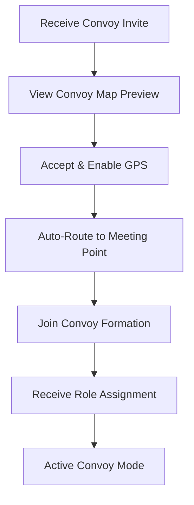
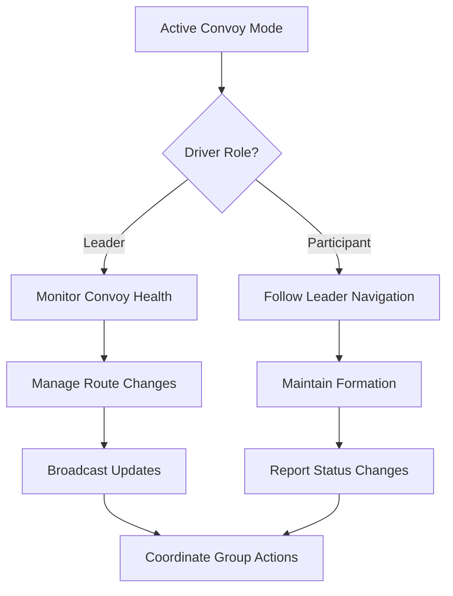
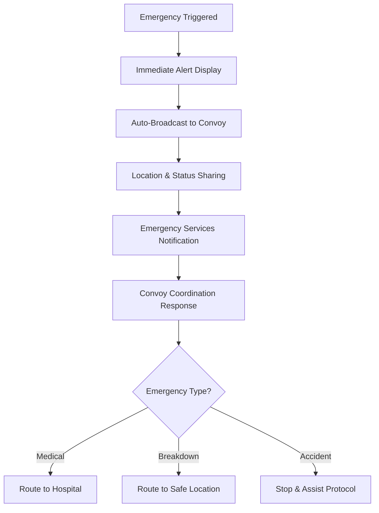

# TuLink Convoy Map System - Design Specification

> **Convoy Coordination Interface Design for Real-Time Multi-Driver Navigation**

## 📋 Table of Contents

1. [Overview](#overview)
2. [Design Principles](#design-principles)
3. [Interface Architecture](#interface-architecture)
4. [Component Specifications](#component-specifications)
5. [User Interaction Flows](#user-interaction-flows)
6. [Safety & Accessibility](#safety--accessibility)
7. [Technical Implementation](#technical-implementation)
8. [Testing & Validation](#testing--validation)

---

## 🎯 Overview

### Vision Statement
Create a safety-first, intuitive map interface that enables multiple drivers to coordinate seamlessly in real-time convoy formations while maintaining focus on road safety and clear communication.

### Key Users
- **Convoy Leader**: Initiates and guides the convoy route
- **Convoy Participants**: Follow and coordinate with convoy leader
- **Emergency Contacts**: Receive alerts during convoy emergencies

### Core Use Cases
1. **Active Convoy Coordination**: Real-time position tracking and formation management
2. **Navigation Guidance**: Turn-by-turn directions optimized for convoy movement
3. **Emergency Communication**: Instant alerts and safety coordination
4. **Route Management**: Dynamic routing and convoy-wide updates

---

## 🏗️ Design Principles

### 1. Safety First
- **Minimal Interaction**: Critical functions accessible within 2 taps
- **Peripheral Awareness**: Status visible without shifting focus from road
- **Fail-Safe Design**: Graceful degradation when connections are lost
- **Emergency Priority**: SOS and safety alerts always accessible

### 2. Clear Communication
- **Visual Hierarchy**: Immediate understanding of convoy status
- **Color Psychology**: Intuitive color coding for status and roles
- **Progressive Disclosure**: Show relevant information based on context
- **Multi-Modal Feedback**: Visual, audio, and haptic confirmation

### 3. Real-Time Coordination
- **Live Updates**: Sub-second position and status updates
- **Predictive Guidance**: Anticipate convoy needs and provide proactive alerts
- **Adaptive Interface**: Adjust based on convoy size and conditions
- **Seamless Handoffs**: Smooth leader transitions and role changes

---

## 🏛️ Interface Architecture

### Screen Layout Structure

```
┌─────────────────────────────────────────────┐
│  📊 Convoy Status Bar                       │  ← Always visible
├─────────────────────────────────────────────┤
│                                             │
│              🗺️ MAP VIEW                   │  ← Primary focus
│                                             │
│        [Convoy Formation Overlay]           │
│                                             │
├─────────────────────────────────────────────┤
│  🎛️ Quick Actions (Floating)               │  ← Emergency access
├─────────────────────────────────────────────┤
│  🧭 Navigation Panel                       │  ← Route guidance
└─────────────────────────────────────────────┘
```

### Information Hierarchy

1. **Critical Safety** (Always visible, highest contrast)
2. **Convoy Status** (Real-time updates, medium priority)
3. **Navigation** (Route guidance, contextual)
4. **Secondary Actions** (Advanced features, progressive disclosure)

---

## 🧩 Component Specifications

### 📊 Convoy Status Bar

**Location**: Top of screen, always visible
**Purpose**: Provide instant convoy health overview

```
┌─ Convoy Status ────────────────────────────┐
│ 👥 5/6 Connected  📍 2.3km  ⏱️ 12 min    │
│ ⚠️ Sarah lagging (600m)                   │
└────────────────────────────────────────────┘
```

**Elements**:
- **Connection Count**: Active drivers / Total invited
- **Distance to Destination**: Real-time ETA updates
- **Status Alerts**: Lagging drivers, disconnections, hazards
- **Leader Indicator**: Crown icon for convoy leader

**States**:
- 🟢 **Healthy**: All drivers within threshold
- 🟡 **Caution**: Some drivers approaching limits
- 🔴 **Alert**: Action required (lagging, disconnected)
- ⚫ **Emergency**: SOS active or critical issue

### 🗺️ Map View - Convoy Formation Overlay

**Primary Visual Elements**:

#### Driver Markers
```css
/* Leader Marker */
.convoy-leader {
  size: 48px;
  color: #E53E3E;
  border: 3px solid #FFF;
  shadow: 0 2px 8px rgba(0,0,0,0.3);
  crown-icon: true;
  pulse-animation: active;
}

/* Current User (You) */
.convoy-self {
  size: 44px;
  color: #3182CE;
  border: 2px solid #FFF;
  label: "YOU";
  precision-circle: true;
}

/* Convoy Participants */
.convoy-participant {
  size: 40px;
  colors: [#38A169, #DD6B20, #805AD5, #319795, #D69E2E];
  border: 2px solid #FFF;
  initials: true;
}

/* Disconnected/Lagging */
.convoy-issue {
  size: 36px;
  color: #A0AEC0;
  border: 2px dashed #E2E8F0;
  warning-ring: true;
}
```

#### Formation Lines
- **Solid Lines**: Active convoy connections (green #38A169)
- **Dashed Lines**: Stretched connections approaching threshold (yellow #D69E2E)
- **Broken Lines**: Exceeded threshold or lost connection (red #E53E3E)
- **Dynamic Thickness**: Based on connection strength

#### Destination Marker
```css
.destination-marker {
  icon: "🏁" / custom-flag;
  size: 52px;
  color: #FF6B35;
  animation: gentle-bounce;
  label: destination-name;
}
```

### 🚨 Quick Actions Panel

**Layout**: Floating bottom panel, swipe-accessible
**Purpose**: Emergency and convoy coordination actions

```
┌─ Emergency ─┐  ┌─ Convoy ────┐  ┌─ Communication ─┐
│ 🚨 SOS      │  │ 🛑 Stop     │  │ 💬 Chat         │
│ ⚠️ Hazard   │  │ ⛽ Gas      │  │ 📢 Announce     │
│ 🚔 Police   │  │ 🔄 Leader   │  │ 🤝 Invite       │
└─────────────┘  └─────────────┘  └─────────────────┘
```

**Interaction Patterns**:
- **Single Tap**: Immediate action for emergency functions
- **Long Press**: Confirmation for convoy-wide actions
- **Swipe Up**: Reveal additional actions
- **Voice Activation**: "Hey TuLink, SOS" for hands-free emergency

### 🧭 Navigation Panel

**Adaptive Display**: Changes based on user role and convoy status

#### For Convoy Leader
```
┌─ Leader Navigation ──────────────────────────┐
│ 🧭 Turn right in 800m onto Highway 101      │
│ ⚡ Convoy impact: +2 min (group coordination) │
│ 📊 3/5 drivers ready for turn               │
└──────────────────────────────────────────────┘
```

#### For Convoy Participants  
```
┌─ Participant Navigation ────────────────────┐
│ 👑 Follow Sarah - Turn right in 800m       │
│ 📍 You are 150m behind leader (Good)       │
│ ⏱️ Estimated arrival: 3:45 PM              │
└─────────────────────────────────────────────┘
```

**Navigation Features**:
- **Advanced Warning**: 2km, 1km, 500m alerts for major turns
- **Convoy Pacing**: Adjusted ETAs based on group coordination time
- **Lane Guidance**: Enhanced visibility for convoy lane changes
- **Merge Alerts**: Early warnings for convoy regrouping

### 💬 Communication System

#### Priority-Based Messaging
```
🚨 CRITICAL (Red Background)
└─ Emergency SOS alerts
└─ Accident/breakdown reports
└─ Police/safety hazards

⚠️ IMPORTANT (Orange Background)  
└─ Leader route changes
└─ Stop/break requests
└─ Weather condition updates

ℹ️ GENERAL (Blue Background)
└─ Arrival time updates
└─ General convoy chat
└─ Non-urgent coordination
```

#### Quick Communication Templates
```
Pre-defined Messages:
• "Need gas at next station ⛽"
• "Taking a break at next rest stop 🛑"
• "Police ahead - slow down 🚔"
• "Construction zone - merge left ⚠️"
• "All good here ✅"
• "Running 5 minutes late ⏰"
```

---

## 🚗 User Interaction Flows

### 1. Joining Active Convoy



**UI Flow Details**:
1. **Invitation Screen**: Shows convoy route, participants, estimated join time
2. **Permission Request**: GPS, location sharing, notifications
3. **Navigation Integration**: Automatic routing to convoy leader
4. **Formation Integration**: Seamless addition to convoy visualization
5. **Role Confirmation**: Leader or participant status confirmed

### 2. Active Convoy Management



**Leader Responsibilities**:
- Monitor convoy formation and health
- Make route decisions and broadcast changes
- Coordinate stops, breaks, and group actions
- Handle emergency situations and handoffs

**Participant Responsibilities**:
- Maintain position in convoy formation
- Follow navigation updates from leader
- Report issues or status changes
- Respond to leader coordination requests

### 3. Emergency Response Flow



**Emergency Types & Responses**:
- **Medical Emergency**: Auto-route to nearest hospital, emergency services
- **Vehicle Breakdown**: Safe roadside assistance coordination
- **Accident**: Stop convoy, coordinate assistance, traffic management
- **Weather/Road Hazards**: Route adjustment, convoy regrouping

---

## 🛡️ Safety & Accessibility

### Safety-First Design

#### Distraction Minimization
```
Design Guidelines:
✅ Large touch targets (minimum 48x48dp)
✅ High contrast text (WCAG AA compliance)
✅ Single-hand operation support
✅ Voice command integration
❌ No complex gestures while driving
❌ No small text or detailed information
❌ No multi-step critical actions
```

#### Emergency Protocols
- **One-Tap SOS**: Instant emergency broadcast to convoy and services
- **Automatic Leader Handoff**: If leader has emergency, automatic delegation
- **Convoy Disbanding**: Emergency protocol for convoy separation
- **Safe Stop Coordination**: Coordinated emergency stopping procedures

### Accessibility Features

#### Visual Accessibility
- **Dark Mode Optimization**: Reduced eye strain during night driving
- **Color-Blind Support**: Icons and patterns supplement color coding
- **High Contrast Mode**: Enhanced visibility in bright sunlight
- **Scalable Interface**: Adjustable text and icon sizes

#### Motor Accessibility  
- **Voice Commands**: Hands-free operation for all critical functions
- **Gesture Alternatives**: Simple swipes replace complex interactions
- **One-Handed Use**: All functions accessible with single hand
- **Reduced Precision**: Large targets accommodate driving conditions

#### Cognitive Accessibility
- **Consistent Patterns**: Predictable interface behavior
- **Progressive Disclosure**: Show only relevant information
- **Clear Status Indicators**: Obvious visual and audio feedback
- **Minimal Memory Load**: Interface remembers user preferences

---

## ⚙️ Technical Implementation

### Real-Time Data Architecture

```typescript
interface ConvoyState {
  convoyId: string;
  leader: DriverInfo;
  participants: DriverInfo[];
  route: RouteInfo;
  formation: FormationStatus;
  emergencyStatus?: EmergencyInfo;
}

interface DriverInfo {
  id: string;
  name: string;
  position: GPSCoordinate;
  speed: number;
  heading: number;
  connectionStatus: 'connected' | 'weak' | 'disconnected';
  lastUpdate: timestamp;
  batteryLevel?: number;
}

interface FormationStatus {
  cohesionLevel: 'tight' | 'spread' | 'scattered' | 'broken';
  laggers: DriverInfo[];
  averageSpeed: number;
  estimatedArrival: timestamp;
}
```

### Performance Requirements

```yaml
Real-Time Updates:
  - Position Updates: <= 1 second latency
  - Emergency Alerts: <= 500ms propagation
  - Route Changes: <= 2 second convoy-wide notification
  - UI Responsiveness: <= 100ms interaction feedback

Offline Capabilities:
  - Last Known Positions: 5-minute cache
  - Offline Maps: Pre-downloaded route area
  - Emergency Protocols: Local emergency numbers
  - Battery Optimization: Adaptive update frequency

Network Efficiency:
  - Data Compression: Position data packets < 1KB
  - Update Frequency: Dynamic based on speed and proximity
  - Bandwidth Management: Prioritize critical over social features
  - Reconnection: Automatic with exponential backoff
```

### Integration Points

```typescript
// Core Flutter Components
components: [
  'MapboxMap',           // Primary map rendering
  'LocationProvider',    // GPS and positioning
  'WebSocketManager',    // Real-time communication
  'NotificationService', // Alerts and emergency
  'VoiceController',     // Hands-free operation
  'OfflineMapManager'    // Cached map data
];

// External Services
services: [
  'TuLink API',         // Convoy management backend
  'Emergency Services', // 911/Emergency integration  
  'Weather API',        // Condition-based alerts
  'Traffic API',        // Route optimization
  'Voice Recognition',  // Hands-free commands
];
```

---

## 🧪 Testing & Validation

### User Testing Scenarios

#### Safety Testing
1. **Emergency Response Time**: Measure time from emergency to convoy notification
2. **Distraction Assessment**: Eye tracking during critical convoy actions
3. **One-Handed Operation**: Verify all functions work with single hand
4. **Voice Command Accuracy**: Test hands-free operation in driving conditions

#### Convoy Coordination Testing
1. **Formation Maintenance**: Test convoy cohesion across different group sizes
2. **Communication Clarity**: Verify message priority and delivery success
3. **Route Adaptation**: Test dynamic routing with convoy considerations
4. **Leader Handoff**: Validate smooth leadership transitions

#### Real-World Validation
```yaml
Test Scenarios:
  Urban Convoy:
    - City traffic navigation
    - Frequent stop-and-go
    - Multiple lane changes
    - Parking coordination

  Highway Convoy:
    - High-speed formation
    - Long-distance coordination
    - Rest stop management
    - Weather adaptation

  Emergency Situations:
    - Vehicle breakdown response
    - Medical emergency handling
    - Route deviation recovery
    - Communication system failure
```

### Success Metrics

#### Safety Metrics
- **Emergency Response Time**: < 30 seconds from trigger to convoy awareness
- **Distraction Events**: < 2% increase in attention away from road
- **Incident Reduction**: Measurable decrease in convoy-related issues

#### Coordination Metrics
- **Formation Cohesion**: > 80% time within optimal distance thresholds
- **Communication Effectiveness**: > 95% message delivery success rate
- **Route Completion**: > 98% successful convoy arrivals

#### User Satisfaction
- **Ease of Use**: > 4.5/5 user rating for interface simplicity
- **Safety Confidence**: > 4.3/5 user confidence in convoy safety features
- **Feature Adoption**: > 70% usage of core convoy coordination features

---

## 🚀 Implementation Roadmap

### Phase 1: Safety Foundation (Weeks 1-3)
- [ ] Emergency SOS system implementation
- [ ] Basic convoy formation visualization  
- [ ] Real-time position tracking
- [ ] Core safety features testing

### Phase 2: Convoy Coordination (Weeks 4-6)  
- [ ] Leader/participant role management
- [ ] Navigation integration for convoy movement
- [ ] Communication system implementation
- [ ] Formation health monitoring

### Phase 3: Enhanced Experience (Weeks 7-9)
- [ ] Voice command integration
- [ ] Advanced hazard detection and alerts
- [ ] Convoy analytics and optimization
- [ ] Social coordination features

### Phase 4: Optimization & Scale (Weeks 10-12)
- [ ] Performance optimization for large convoys
- [ ] Advanced accessibility features
- [ ] Integration with external emergency services
- [ ] Production deployment and monitoring

---

## 📚 Appendix

### Design References
- **Uber Driver App**: Active trip interface patterns
- **Waze**: Social driving and hazard reporting
- **Google Maps**: Navigation clarity and turn-by-turn guidance
- **Military Convoy Systems**: Formation management and communication protocols

### Accessibility Standards
- **WCAG 2.1 AA**: Web accessibility guidelines compliance
- **Apple HIG**: iOS accessibility best practices  
- **Material Design**: Android accessibility guidelines
- **Automotive UX**: In-vehicle interface safety standards

### Technical Standards
- **Flutter Material 3**: Design system compliance
- **Mapbox SDK**: Map rendering and performance standards
- **WebSocket RFC 6455**: Real-time communication protocol
- **GPS/Location APIs**: Position accuracy and update frequency standards

---

*This design specification serves as the comprehensive guide for implementing TuLink's convoy map system, prioritizing safety, usability, and effective real-time coordination among convoy participants.*